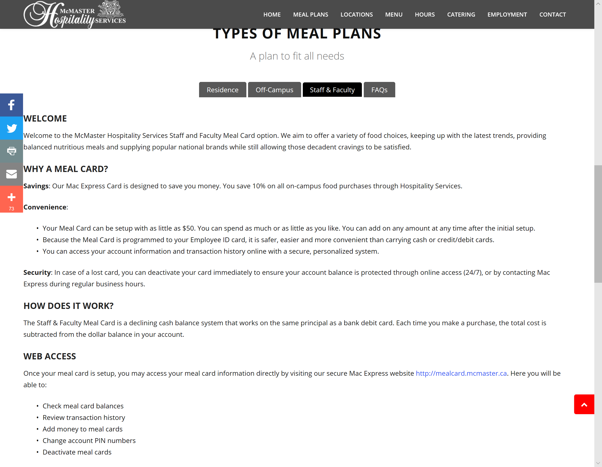
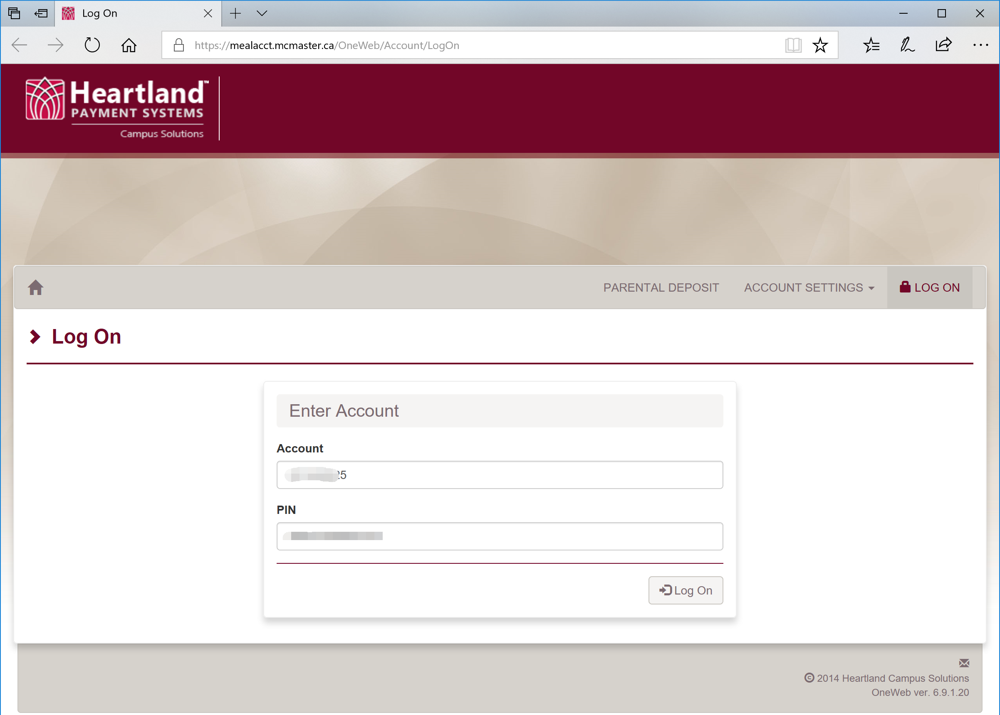
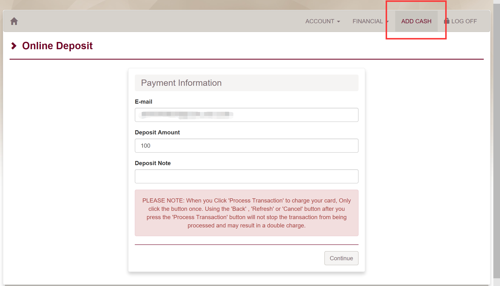
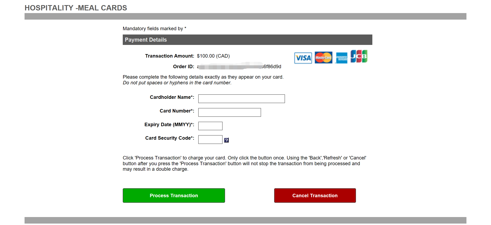
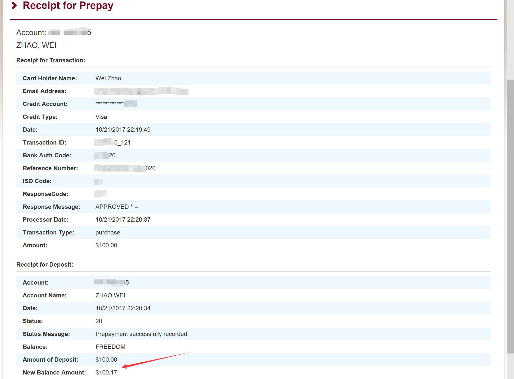

餐厅
===========================
.. attention::
   **学长学姐们强烈建议大家自己做饭，而不是去餐厅！！！**

在介绍McMaster餐厅之前，大家需要知道McMaster的餐厅和国内的食堂是有极大的不同的。国内的食堂（canteen）一般是高校自己开设的，并且有国家的补助，所以里面的饭菜才会很便宜。而McMaster的餐厅（hospitality或cafeteria或简称“cafe”）完全是第三方开设的，他们仅仅是租用了学校的地方，最多使用了McMaster的学生卡支付系统，所以里面卖的食物的价格较高。

McMaster餐厅官网
-----------------------------------------
- 官网主页：http://hospitality.mcmaster.ca/
- Meal Plan：http://hospitality.mcmaster.ca/meal_plans/meal-plans.html
- Hour：http://hospitality.mcmaster.ca/hours.html
- On-Campus Location（校内的餐厅、咖啡店、小吃店）：http://hospitality.mcmaster.ca/on-campus.html
- Off-Campus Location（和学校有合作的校外餐厅，可以使用带有Meal Plan的学生卡或工卡支付）：http://hospitality.mcmaster.ca/off-campus.html

McMaster餐厅介绍
--------------------------------------------
McMaster的可以吃饭的地方有很多，大型的餐厅主要有4个：

1. CENTRO @ Commons

- 俗称“北餐厅”，在Commons Building，这个餐厅是学校最大的餐厅，主要以西餐为主。
- http://hospitality.mcmaster.ca/locations/centro.html

2. EAST MEETS WEST BISTRO

- 俗称“西餐厅”，在Mary K.Eyes Building， 这个餐厅主要提供世界各地的菜肴，当然包括中餐。
- http://hospitality.mcmaster.ca/locations/emw-bistro.html

3. The Phoenix

- 1969年在学校里成立的酒吧，同时也是GSA的俱乐部所在地。这个地方除了提供酒水饮料外，也提供较为全面的西餐。如果有GSA stickers（小秘会发邮件通知领取），可以在这个餐馆里吃饭享受9折优惠 https://gsamcmaster.org/student-specials/ 。
- https://www.phoenixmcmaster.com/
- 地点：自Hamilton Hall沿着Scholars Rd向西走经过的北边第二个房子。

4. Student Center一楼

Meal Plan
-------------------------------------
| 官网介绍：http://hospitality.mcmaster.ca/meal_plans/meal-plans.html
| 对刚刚到McMaster的新生来说，学校餐厅里的食物可以说量少且非常昂贵。办理Meal Plan可以获得相应的打折，方法是向Student Card（学生卡）或Working at McMaster卡（工卡）里充钱，在支付的时候直接刷学生卡或工卡就可以了。学生卡或工卡不但可以用于上面介绍的餐厅，也可以用在学校里任何一个On-Campus Location或Off-Campus Location的餐饮店。

1. Off-Campus Meal Plan

.. image:: resource/CanTing/OffCampusMealPlan.png
   :align: center

Off-Campus Meal Plan对于所有住在校外的学生都可以申请，按计费方式又分为两种小的Meal Plan：

- Freedom Plan（建议）

  - 大家向Student Card里充钱之后，可以随便用，没有时间限制，并且可以便宜5%。最少一次充$100。支付的时候必须刷Student Card。
  - 举例：买$10的食物，所需的费用是：10*(1+13%)*95%≈10.74

- Term Plan

  - 学校规定：至少一次充4周，每周最少$65。也就是说，必须在相应时间段内花完充的钱，过期作废。如果这种方法可以不用交13%的消费税。
  - 举例：假如一次充4周，每周$65，则在4周内必须花完$260，过期作废，不退款。买$10的食物：所需的费用就是$10。

申请Off-Campus Meal Plan的方法：填好网页里的表格，交到MAC Express Office（Commons Building 128)；或者可以直接去办公室填表，立即生效。第一次申请Meal Plan和充值必须带上 **Student Card**，亲自去一趟MAC Express Office。

2. Staff & Faculty Meal Plan

Staff & Faculty Meal Plan只能给学校的Staff和Faculty。Staff通常指学校的教学科研助理、行政、后勤人员，如果大家有TA、RA，或者在学校找到了行政职位，或在麦马读Post Doc，则属于Staff。Faculty一般指科研人员，比如教授们。所以如果大家符合Staff的条件可以不申请上面的Off-Campus Meal Plan，而直接申请Staff & Faculty Meal Plan。Staff & Faculty Meal Plan优于Off-Campus Meal Plan里的Freedom Plan。因为Staff & Faculty Meal Plan在On-Campus Location或Off-Campus Location的餐饮店买东西时给10%的折扣。

- 大家向Working at McMaster卡里充钱之后，可以随便用，没有时间限制，并且可以便宜10%。最少一次充$50。支付的时候必须刷Working at McMaster卡。
- 举例：买$10的食物，所需的费用是：10*(1+13%)*90%≈10.17

申请Staff & Faculty Meal Plan的方法：填好网页里的表格，交到MAC Express Office（Commons Building 128)；或者可以直接去办公室填表，立即生效。第一次申请Meal Plan和充值必须带上 **Working at McMaster卡**，亲自去一趟MAC Express Office。如果之前办理了Off-Campus Meal Plan，则可以通过这个申请表转成Staff & Faculty Meal Plan。之前在Student Card里充钱的余额也会自动转到Working at McMaster卡里。

充值：

- 以上两大类Meal Plan不仅可以支持线下充钱，也可以在网上充钱。从第二次充值起，就可以在网上操作了，在网上不但可以充值，也可以查看余额。
- 登录账户网址：https://mealacct.mcmaster.ca/OneWeb/Account/LogOn
- 第一次登录需要先重置密码（http://mealcard.mcmaster.ca/acctnfo.htm）：在上面的网页里点击ACCOUNT SETTINGS -> RESET PIN，用户名是你的student ID。以后都用你的student ID和新密码登录。
- 充值步骤：

 | 第一步：登录上面的网址。

| 第二步：点击“ADD CASH”。E-mail填接受收据的邮箱。Deposit Amount填需要存入的金额。Deposite Note可以不填。

| 第三步：填写信用卡的信息。然后点Process Transaction。

| 第四步：交易成功后，一个显示收据的页面。

- 查看余额：登录后点击FINANCIAL->BALANCES。

McMaster周边的西餐
-----------------------------------------
1. 学校南门对面：

- Subway：三明治

  - http://www.subway.com/en-ca
  - 1335 Main St W, Hamilton, ON L8S 1C6
  - (905)522-7827
  - 每天都会对其中一种三明治打折。
  - 手机App：

    - iOS：https://itunes.apple.com/ca/app/subway-app/id901941015
    - Android：https://play.google.com/store/apps/details?id=com.subway.mobile.subwayapp03
  - 大家第一次去如果不知道怎么点餐，可以先在手机App上选好三明治、配方和取的时间，这样到时间去店里直接取就可以了。此外，如果去店里直接买，在付款前可以先扫一下手机App里的二维码获取积分，积分未来可以变成代金券或优惠券。

- Pinks：汉堡薯条

  - http://pinksburgers.com/
  - 1335 Main St W, Hamilton, ON L8S 1C6
  - (905)317-4657
  - 手机App：

    - iOS：https://itunes.apple.com/ca/app/pinks-burgers/id1164540176?mt=8
    - Android：https://play.google.com/store/apps/details?id=com.surepathmobile.pinks

- Quik Chik：炸鸡、薯条

  - http://www.quikchik.ca/
  - 1331 Main St W, Hamilton, ON L8S 1C6
  - (905)306-7861
  - 手机App：

    - iOS：https://itunes.apple.com/ca/app/quik-chik/id1175711315?mt=8
    - Android：https://play.google.com/store/apps/details?id=com.pogocorporation.mobidines.quikchik
  
- Taco：墨西哥餐

  - https://tacodelmar.com/
  - 1331-1335 Main St W #5, Hamilton, ON L8S 1C6
  - (289)389-0900

- Williams Fresh Café：西式咖啡店

  - https://williamsfreshcafe.com/
  - 1309 Main St W, Hamilton, ON L8S 1C5
  - (905)522-2636
  - Williams是一家比较纯粹的西餐和西式咖啡店。推荐里面的hot rice box和vanilla（热的）
  - 手机App：

    - iOS：https://itunes.apple.com/ca/app/williams-fresh-cafe/id935711342?mt=8
    - Android：https://play.google.com/store/apps/details?id=com.d1mobile.williams

- Gino's Pizza：披萨店

  - http://www.ginospizza.ca/
  - 1309 Main St W, Hamilton, ON L8S 1C5
  - (905)525-4444
  - 推荐walk-in special
  - 手机App：

    - iOS：https://itunes.apple.com/ca/app/ginos-pizza/id1132299725?mt=8
    - Android：https://play.google.com/store/apps/details?id=com.menudrive.GinosPizza

- Yogurty's：自助酸奶、冰淇淋店

  - http://www.yogurtys.com/storelocator/store/4657/Main%20%20Cootes/1309%20Main%20Street%20West/Hamilton/Ontario/Canada
  - 1309 Main St W #7, Hamilton, ON L8S 1C5
  - (905)525-2523
  - 手机App：

    - iOS：https://itunes.apple.com/ca/app/yogurtys/id828647980?mt=8
    - Android：https://play.google.com/store/apps/details?id=com.d1mobile.yogurtys

2. 学校东边

- MR.SUB：三明治

  - https://mrsub.ca/
  - 1144 Main St W, Hamilton, ON L8S 1C1
  - (905)521-6965
  - 每天都会对其中一种三明治打折。

- Pita Pit：鸡肉卷

  - https://pitapit.ca/
  - 1056 King St W, Hamilton, ON L8S 1L7
  - (905)529-7482
  - 手机App：

    - iOS：https://itunes.apple.com/ca/app/pita-pit-canada-more/id932480392?mt=8
    - Android：https://play.google.com/store/apps/details?id=com.spoonity.pitapit

- Subway：三明治

  - http://www.subway.com/en-ca
  - 1018 King St W, Hamilton, ON L8S 1L4
  - (905)308-9378
  - 每天都会对其中一种三明治打折。

- Lava Pizza & Wings

  - https://westdale.lavapizza.ca/
  - 876 King St W, Hamilton, ON L8S 4S6
  - (905)525-6606
  - 这家店的pizza可以在网上DIY预订，顾客可以自由选择尺寸、配方、加入的蔬菜肉类等等，等做好后直接去取。

- Pizza Nova：披萨

  - https://pizzanova.com/
  - 1016 King St W, Hamilton, ON L8S 1L4
  - (844)310-3300
  - 手机App：

    - iOS：https://itunes.apple.com/ca/app/pizza-nova/id885029821?mt=8
    - Android：https://play.google.com/store/apps/details?id=com.pizzanova.ui

- Second Cup Westdale：茶水店

  - http://www.secondcup.com/
  - 1004 King St W, Hamilton, ON L8S 1L1
  - (905)540-4839
  - 这是一家专门的茶水店，里面供应各种茶水、咖啡、零食等等。不限制用餐时间。大家可以在这里讨论学习、作业、工作、业务等等。
  - 手机App：

    - iOS：https://itunes.apple.com/ca/app/second-cup-coffee-co/id985820057?mt=8
    - Android：https://play.google.com/store/apps/details?id=com.secondcup.mobile

- TCBY：特色冰淇淋店

  - http://tcbycanada.com/
  - 1059 King St W, Hamilton, ON L8S 1L6
  - (905)572-6866
  - 手机App：

    - iOS：https://itunes.apple.com/us/app/tcby/id1222063860?mt=8
    - Android：https://play.google.com/store/apps/details?id=com.tcby.tcby.android.app

3. 学校西边

- Maple Leaf Pancake House：煎饼、烤肠、炸土豆

  - 1520 Main St W, Hamilton, ON L8S 1C8
  - (905)522-4995

- Tally Ho Restaurants：汉堡薯条

  - https://www.facebook.com/pages/Tally-Ho-Restaurants/114415425271942
  - 1536 Main St W, Hamilton, ON L8S 1E4
  - (905)529-6043

- Boston Pizza：披萨（高档）、汉堡薯条、酒吧

  - https://bostonpizza.com/en/index.html
  - 1563 Main St W, Hamilton, ON L8S 1E6
  - (905)777-1919
  - Groupon App里可以搜到它的优惠券。
  - 手机App：

    - iOS：https://itunes.apple.com/ca/app/boston-pizza/id904724935?mt=8
    - Android：https://play.google.com/store/apps/details?id=com.bostonpizza.bostonpizza

- Wendy's：汉堡薯条

  - https://www.wendys.com/
  - 1585 Main St W, Hamilton, ON L8S 1E6
  - (905)527-1464
  - 手机App：

    - iOS：https://itunes.apple.com/us/app/wendys/id540518599?mt=8
    - Android：https://play.google.com/store/apps/details?id=com.wendys.nutritiontool

- Popeyes Louisiana Kitchen：炸鸡、薯条

  - http://popeyeschicken.ca/
  - https://www.ubereats.com/hamilton/food-delivery/popeyes-louisiana-kitchen-main-st/JghticQNREKy0aAWOAUj8Q/
  - 1711 Main St W, Hamilton, ON L8S 1G5
  - (905)528-2222

- Baskin Robbins & Kernels Popcorn：特色冰淇淋店

  - http://www.baskinrobbins.ca/
  - 1685 Main St W, Hamilton, ON L8S 1G5
  - (905)528-4300

4. Tim Hortons

 | Canada本土的咖啡甜点店。第一家Tim Hortons就成立于Hamilton。它主要供应：咖啡、茶、甜点、早餐等食物。
 | http://www.timhortons.com/ca/en/index.php

- 咖啡

  - http://www.timhortons.com/ca/en/menu/coffee.php
  - 主要有三种：Original Blend、Dark Roast Coffee、Decaf Coffee
  - 一般喝以上原味的咖啡太苦，所以在购买的时候要跟服务员说需要cream和sugar，还可以说需要double或triple cream and sugar。

- 茶

  - http://www.timhortons.com/ca/en/menu/tea.php
  - 主要有两种：Steeped Tea、Specialty Tea
  - Steeped Tea就是店员已经冲好的茶水。
  - Specialty Tea就是各种茶包，买的时候要在杯子里泡一会再喝。Specialty Tea一共有10种，比较推荐的是Green Tea（绿茶）和Orange Pekoe（锡兰红茶）。按照当地人的习惯通常需要加cream和sugar，变成奶茶来喝。

- 热饮

  - http://www.timhortons.com/ca/en/menu/hot-beverages.php
  - 比较推荐：French Vanilla（法国香草）、White Hot Chocolate（热白巧克力）
  - 它们都非常非常甜。

- 冷饮

  - http://www.timhortons.com/ca/en/menu/cold-beverages.php
  - 其中Iced Capp是比较受欢迎的。

- 其它还有各种甜点、鸡肉卷、汉堡、三明治、薯饼等等。可以在官网上的menu里查到。也可以使用App查询：“Tim Hortons”。如下图所示。一般小的Tim Hortons店里只有甜点。

  - iOS：https://itunes.apple.com/ca/app/tim-hortons/id1143883086?mt=8
  - Android：https://play.google.com/store/apps/details?id=digital.rbi.timhortons

.. image:: /resource/CanTing/CanTing_Tim_App.png
   :align: center
   :scale: 25%

- 地点：

  - McMaster Student Center一楼
  - McMaster东边：951 King St W, Hamilton, ON L8S 1K9
  - McMaster南边：1445 Main St W, Hamilton, ON L8S 1C8
  - McMaster西边：1554 Main St W, Hamilton, ON L8S 1E5
  - 历史上第一家成立的Tim Hortons：65 Ottawa St N, Hamilton, ON L8H 3Y9
- DIY

  - 虽然一杯咖啡只要$1~2，但依然有更为省钱的方法。Tim Hortons在Amazon上有网店，里面卖几乎所有的咖啡、热饮等等。如果大家经常喝，可以一次性买一大桶，回来自己冲泡。一大桶咖啡不会超过20刀，一大桶热饮不会超过10刀。足够冲泡几十杯，喝很长时间。
  - https://www.amazon.ca/s/field-keywords=tim+hortons

Hamilton其它地方的西餐
---------------------------------------------
1. 市中心（downtown）

- McDonald's（麦当劳）

  - https://www.mcdonalds.com/ca/en-ca.html
  - 50 Dundurn St S, Hamilton, ON L8P 4W3
  - (905)577-1027
  - 手机App“My McD's”：
  
    - iOS：https://itunes.apple.com/ca/app/my-mcds/id375695000?mt=8
    - Android：https://play.google.com/store/apps/details?id=com.mcdonalds.superapp
  - 麦当劳24小时营业。
  - 优惠券（如果有强烈建议使用）

    - 一种是digital mailer coupons，这种优惠券通常每个term开学之后的那一两个月有效。下载地址：https://www4.mcdonalds.ca/coupons/ 。优惠券的使用：打开链接选择省份后，打印coupons（放在手机里也行），到麦当劳店里后可以在自助点餐亭里扫条形码，或手动输入即可。
    - 还有一种mobile App优惠券，麦当劳会对某几种食物打折，一般有效期只有一周。大家可以下载App之后查看。
  - 点餐方式：

    - Front Table：就是最传统的方式，在服务台跟服务员说。如果大家刚来，不知道菜单上有哪些食物，甚至不知道怎么表达，在服务台点餐可能会花较多的时间，甚至不能买到想要的食物。比较推荐大家用下面两种方式。
    - Kiosk：在自助点餐亭点餐。这个最推荐的。麦当劳店里的自助点餐亭里有所有食物菜单及其图片。大家可以慢慢得看，一个一个选。付款后，打印的发票上有号码，如果所点食物准备完毕，服务员会叫号。
    - Mobile Ordering：用麦当劳的手机App点餐，可以选好哪个麦当劳的营业点，在线支付。到营业点里取。（这个就相当于在手机上点餐付款，但必须本人到店里和前台服务员确认后，店员才会开始准备食物）

- KFC（肯德基）

  - http://www.kfc.ca/store/631-king-st-w-hamilton
  - 631 King St W, Hamilton, ON L8P 1C4
  - (905)528-8583
  - 肯德基不是24小时营业，一般上午11点才开门，晚上九十点就关了，大家在Google地图上查好营业时间。
  - 优惠券：http://www.kfc.ca/coupons

2. 山上

- The Keg Steakhouse + Bar（烤牛排）：点菜制

  - https://www.kegsteakhouse.com/locations/hamilton-keg/
  - 1170 Upper James St, Hamilton, ON L9C 3B1
  - (905)574-7880

Hamilton 中餐馆
----------------------------------
1. 学校周边（Zone 1）：

- The Arch Noodle House（校门口）：点菜制

  - 1309 Main St W, Hamilton, ON L8S 1C5
  - 18年秋季，在学校南门对面新开了一家拉面馆。

- Mr. Gao（高老庄）：点菜制，外卖

  - http://www.gaolaozhuang.ca
  - 1561 Main Street West Hamilton, ON L8S 1E6
  - (289)309-1363
  - 可以使用现金或debit卡（多付几十分）。

- Dragon Court Restaurant（龙庭）：点菜制，外卖

  - http://www.westdaledragoncourt.com
  - 988 King Street W. Hamilton, ON L8S 1L1
  - (905)522-1999
  - 可以使用现金、debit卡、信用卡。

- South China（华南）：外卖

  - http://southchina.chinesemenu.com/
  - 1223 Main St W, Hamilton, ON L8S
  - (905)528-8474 

- Beijing Hut（北京小屋）：点菜制

  - 1467 Main St W, Hamilton, ON L8S 1C9 
  - (905)521-8886 

- Wei Xiang Yuan 北京面点：点菜制

  - https://plus.google.com/photos/photo/105671526178142822524/6536351373545148434
  - 1088 Main St W, Hamilton, ON L8S 1B3
  - (905)297-4702 

2. 市中心（Downtown）：

- LiuLiu Hot Pot（老乡四川）：自助火锅

  - https://www.facebook.com/liuliuhotpot
  - 11 Walnut St S, Hamilton, ON L8N 2K8
  - (905)581-0354
  - 周一周二不营业。可以使用现金或debit卡。这个火锅店附带KTV，在此用餐后KTV有优惠。

- Sparkle Northern Chinese Cuisine美食美客：点菜制，外卖

  - http://www.sparklenorthernchinese.com/
  - 165 King St. East, Hamilton
  - (905)529-2226

- Szechuan Noodle Bowl Restaurant（顺椿原）：点菜制

  - https://www.shunchunyuan.com/
  - 117 King St E, Hamilton, ON L8N 1A9
  - (905)522-8886
  - 微信公众号：顺椿原

- Sunrise Restaurant（马队长牛肉拉面）：点菜制

  - http://www.sunriseday.com/
  - 242 King St W, Hamilton, ON L8P 1A9
  - (905)522-6351

- Noodle Me（味道拉面）：点菜制

  - https://www.facebook.com/noodlemerestaurant
  - 1 Wilson St #7, Hamilton, ON L8R 1C4
  - (905)540-1166

- Squares Hot Pot（九宫格）：自助火锅

  - 80 James St. North
  - (905)525-1488
  - 价格：周一~周四：午餐$21.99，晚餐$23.99；周五~周日：午餐$26.99，晚餐$28.99。锅底另付：清汤：$7.99，鸳鸯：$8.99，九宫格：$9.99

- Great Red Peppers（红海椒）：点菜制

  - 60 James St N, Hamilton, ON L8R 2K1
  - (905)523-4888

- O'Neko Hotpot & Ramen（海捞）：自助火锅
 
  - https://www.facebook.com/pages/Oneko-Hot-Pot/610269105715666
  - 129 King St. E., Hamilton, ON
  - 只能使用现金。

- Grand Leisure Gastro House（盛宴国际）：点菜制

  - https://www.grandleisure.ca/
  -	16 Jarvis St, Hamilton, ON L8R 1M2 
  - (905)522-9888
  - 这家店的饮食已经不是它主要业务了，仅仅算是小吃。它主要运营KTV。

- Mr.Dumpling：点菜制，外卖

  - 50 Dundurn St. South L8P 4W3
  - (905)570-1388
  - 这家店不仅仅卖水饺，还有其它快餐。

- K w BBQ Kitchen（琪华）：点菜制

  - 103 Queen St N, Hamilton, ON L8R 2V5
  - (905)577-6888

- 8090 TEAHOUSE：点菜制，外卖

  - http://www.teahouse8090.com/
  - 149 King St E, Hamilton, ON L8N 1B1
  - (905)525-8788

- TeaFun：外卖

  - http://www.foodfun.ca/
  - 139 King St E, Hamilton, ON L8N 1B1
  - (289)389-8688
  - 手机App：

    - iOS：https://itunes.apple.com/app/id1222977577?mt=8
    - Android：https://play.google.com/store/apps/details?id=com.foodfun.foodfun

- Mark's Chinese Food & Tavern（中华酒家）：点菜制，外卖

  - 468 King St W, Hamilton, ON L8P 1B8
  - (905)527-7621

- Crystal Dynasty Chinese Restaurant（美味栈粤菜馆 ）：点菜制

  - 94 Cannon St W, Hamilton, ON L8R 2B6
  - (905)308-8208

- Forbidden City Chinese Restaurant：外卖，点菜制

  - https://www.forbidden-city-chinese.com/
  - 273 King St E, Hamilton, ON L8N 1B9
  - (905)528-5945

3. 山上（Mountain）：

- Mandarin：中餐自助

  - https://mandarinrestaurant.com/
  - 1508 Upper James St, Hamilton, Ontario L9B 1K3
  - (905)383-6000
  - 可以使用现金、debit卡、信用卡。

4. 其它：https://cn.tripadvisor.com/Restaurants-g154990-Hamilton_Ontario.html

Hamilton 中式甜点
-----------------------------------------
- CoCo Fresh Tea & Juice（Coco奶茶）

  - https://www.facebook.com/CoCoFreshTeaHamilton
  - 96 Main St E, Hamilton, ON L8N 1G3
  - (905)521-6888
- Sugar Marmalade（糖记）

  - http://www.sugarmarmalade.com/
  - 65 King St E, Hamilton, ON L8N 1A5
  - (905)527-9699

Hamilton 越南米粉
------------------------------------
- Saigon

  - http://www.saigonasianrestaurant.com/
  - 1024 KING ST W
  - (905)528-1096
  - 可以使用现金或debit卡（多付几十分）。

- NATIONS（进入超市一直走到最东边，可以询问服务员具体位置）

  - http://nationsfreshfoods.ca/pho.html
  - 2 King St W #445, Hamilton
  - 可以使用现金或debit卡。

- PHO RONG WONG

  - http://phorongvang.com/
  - 1120 MAIN ST W
  - (289)389-8989
  - 可以使用现金或debit卡（多付几十分）。

- Ben Thanh Viet Thai Restaurant（边城）

  - http://www.benthanh.ca/
  - 113 JAMES ST N
  - (905)528-6888
  - 可以使用现金、debit卡、信用卡。

Hamilton 韩餐
-------------------
- ALIRANG（阿里郎）

  - https://www.facebook.com/pages/Alirang/617187441640072
  - 354 Main St W, Hamilton, ON L8P 1K3
  - (905)777-1236
  - 可以使用现金、debit卡、信用卡。

- Manna Korean Takeout：外卖

  - 1050 King St W, Hamilton, ON L8S 1L5
  - (905)523-0777

- OWL（猫头鹰）

  - http://www.owlfamily.ca/
  - 309 Main St E, Hamilton, ON L8N 1H8
  - (905)528-7275
- Korean house

  - 281 Cannon St E, Hamilton, ON L8L 2B4
  - (905)526-1492
- Ajio Restaurant

  - http://www.ajiosushikorea.com/
  - 161 King St E, Hamilton, ON L8N 1B1
  - (905)526-8888
- Spring grill house：韩式自助烧烤

  - http://springgrillhouse.com/
  - 1441 UPPER JAMES ST
  - (905)383-6868
  - 可以使用现金、debit卡、信用卡。

Hamilton 日料
--------------------------
- Yukiguni Izakaya：自助

  - http://yukiguni-hamilton.com/
  - Unit 6, 1686 Main St W #8, Hamilton, ON L8S 0A2
  - (905)527-5272

- August 8：自助

  - http://www.august8.ca/
  - 1 Wilson St #12, Hamilton, ON L8R 1C4
  - (905)524-3838
  - 可以使用现金、debit卡、信用卡。

- Joya Sushi：点菜制

  - http://joyasushi.ca/
  - 1630 Main St W, Hamilton, ON L8S 1G3
  - (905)525-1114
  - 可以使用现金、debit卡、信用卡。

- Sapporo Restaurant（札幌）：自助

  - http://sapporo-hamilton.com/
  - 96 Main St E, Hamilton, ON L8N 1G3
  - (905)527-1668

- Tatemono Sushi Bar & Restaurant：自助

  - http://www.tatemono.ca/
  - 135 King St E., Hamilton, ON L8N 1B2
  - (905)521-2227
  - 可以使用现金、debit卡、信用卡。

- Kenzo Ramen：点菜制
	
  - http://www.kenzoramen.ca/g5/
  - 21 King St W, Hamilton, ON L8P 1B5
  - (905)577-6666
  - 这是一家日式拉面馆。

其它城市的特色餐厅
------------------------------------------------
大多伦多地区中餐厅汇总：https://kb.51.ca/item/list ，或地图模式：https://kb.51.ca/item/map

Toronto：

- Little Sheep Mongolian Hot Pot（小肥羊）：自助火锅

  - https://www.littlesheephotpot.com/location/toronto-downtown-on
  - 421 Dundas St W, Toronto, ON M5T 2W4
  - (416)792-8885
  - 可以用微信或者支付宝支付。

- Morals Village Hot Pot（德庄）：自助火锅

  - http://cqdz.ca/zh/home-5/
  - 436 Dundas Street West, Toronto, ON, M5T 1G7
  - (647)352-7588

- Dagu Rice Noodles Downtown（大鼓米线）

  - http://daguricenoodle.ca/ （官网上有多伦多市中心周末的分店的地址）
  - 115 Dundas St W, Toronto, ON M6K 1T7
  - (416)901-9208

- Crown Price Fine Dining and Banquet（紫京盛宴）：粤菜、早茶

  - http://www.crown-prince.ca/english/index.asp
  - 3600 Victoria Park Ave, North York, ON M2H 3B2
  - (416)490-8893

Mississauga：

- Little Sheep Mongolian Hot Pot（小肥羊）：自助火锅

  - https://www.littlesheephotpot.com/location/mississauga-on
  - 1100 Burnhamthorpe Rd W #17, Mississauga, ON L5C 4E9
  - (905)232-7775
  - 可以用微信或者支付宝支付。

- Morals Village Hot Pot（德庄）：自助火锅

  - http://cqdz.ca/zh/home-5/
  - Unit 2, 1177 Central Pkwy W, Mississauga, ON L5C 4P3
  - (905)276-6768

- Bashu Sichuan Cuisine（巴蜀人家）

  - http://bashuonline.com/index.htm
  - 4559 Hurontario Street #7, Mississauga, ON L4Z 3X3
  - (905)568-9988
  - 非常地道的川菜，很辣，但是很好吃。

- Red Lotus Restaurant（满江红）：川菜

  - 1177 Central Pkwy W, Mississauga, ON L5C 4P3
  - (905)896-8828

- Foodie North（北食客）：鲁菜以及北方菜

  - http://foodienorth.com/
  - 325 Central Pkwy W #2&4, Mississauga, ON L5B 3X9
  - (905)277-8989
  - 推荐鱼头泡饼，北京烤鸭

- Silk Road Restaurant（丝绸之路）：西北菜

  - http://www.thesilkroad.ca/
  - 1852 Dundas St E, Mississauga, ON L4X 1L9
  - (905)279-9444
  - 推荐大盘鸡、烤羊肉串儿等。

- Emerald Chinese Restaurant（康翠酒楼）：广式早茶

  - http://www.emeraldchineserestaurant.com/
  - 30 Eglinton Ave W, Mississauga, ON L5R 3E7
  - (905)890-9338

- Long Zu BBQ（龙族烧烤）

  - 888 Dundas Street East A2, Mississauga, ON L4Y 4G6
  - (905)803-9333

经验之谈
-----------------------------------
- 强烈建议大家自己做饭，原因主要有：校内外的餐厅和甜点店主要以西餐为主，一般从中国来的学生吃不惯，量少且贵。
- 花费：从以往的经验来看，如果坚持自己做饭，每月的饮食类的花费大多在$200~$300左右。如果一直在外面买，则是$700/月，一般比这个要多得多。在学校餐厅吃，可能每天就要花掉$30左右。
- 体重问题：西餐的热值能量非常高，例如麦当劳肯德基类的垃圾食品，即使只吃一点，摄入的能量几乎相当于几顿中餐。很多同学来这不注意，刚来的3个月体重增长20斤比比皆是。大家引以为戒。
- 最后希望大家能锻炼出好的手艺，不至于在同学家聚餐的时候什么也不会。

注
-------------------
1) 小费：大家不管消费多少都应该按照这边的礼仪给一定的小费。一般比例为消费金额的10%。此外，很多餐馆的小费是完全被老板收走，比如hotaru sushi。对于这样的餐馆可以一分钱小费都不给。大家给小费之前可以问清楚。
#) 对于所有的自助餐餐馆，通常情况下，晚上的价格比中午要贵一些，周末的价格比工作日的价格要贵一些。所以工作日的中午价格最便宜，周末的晚上价格最高。大家去之前一定要在官网上查清楚，或打电话询问。很多自助餐馆的工作日仅仅指周一到周四，周五则按周末的标准计费。
#) 去亚洲餐馆吃饭，尤其是中餐馆或越南餐馆，请打电话或向其它同学询问是否可以刷卡。绝大多数亚洲餐馆都只能付现金，如果使用debit卡通常会多出几十分。少数亚洲餐馆可以刷信用卡。大家问清楚再去，以便事先准备好现金。
#) 去餐馆吃饭，最好先打电话预约一下座位。尤其是饭点的时候或集体聚餐。

.. admonition:: 本页作者
   
   - 17-CAS-赵伟
   - 14-BME-Yushan Zhang
