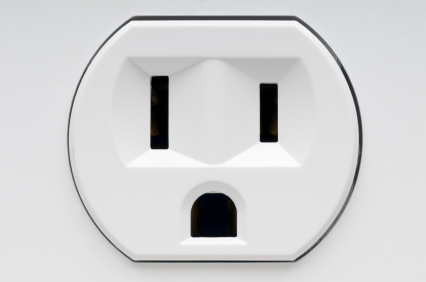

其它生活经验汇总
=========================
加拿大政府官方天气手机App —— WeatherCAN
--------------------------------------------------------------------------------------------------
- 官网：https://www.canada.ca/en/environment-climate-change/services/weather-general-tools-resources/weathercan.html
- 手机App：

  - iOS：https://apps.apple.com/ca/app/id1334221563
  - Android：https://play.google.com/store/apps/details?id=ca.gc.ec.weather_app_android.ops

各大论坛网站
--------------------------------------
综合：

- 加国无忧：http://www.51.ca/

  - 手机App，微信小程序：http://app.51.ca/
  - 微信公众号：www51ca
  - 网址导航：https://123.51.ca/
- 问吧：http://www.wenba.ca/ 

  - 手机App：http://app.wenba.ca/
- 加拿大省钱快报：https://www.dealmoon.ca/

  - iOS：https://itunes.apple.com/us/app/jia-na-da-sheng-qian-kuai/id867845107?mt=8
  - Android：https://play.google.com/store/apps/details?id=ca.com.dealmoon.android
  - 微信公众号：dealmoonca

多伦多地区：

- 约克论坛（多伦多地区）：http://www.yorkbbs.ca/
- 家园·多伦多（多伦多新闻）：http://toronto.iask.ca/

Hamilton：

- Hamilton 华人网：http://www.hamiltonchinese.ca/

拍照和冲洗照片
---------------------------------------------------------
来这之后可能需要近照，比如办理去其它国家的签证等等。通常证件照可以在Shoppers Drug Mart、Costco、Jackson Square的Pro Photo拍摄。冲洗照片可以用Walmart的服务。

1. Shoppers Drug Mart：

- 官网：https://www1.shoppersdrugmart.ca/en/pcoptimum/in-store-offers/passport-photo
- 介绍：通常当场照相后就可以冲洗出来，大概20刀。但不能得到电子版。

2. Costco

- 官网：https://www.costcophotocentre.ca/Home
- 介绍：需要Costco会员卡。

3. Pro Photo

- 官网：https://prophotoprinthamilton.com/passport-photos/
- 地址：Jackson Square near Sheraton Hotel, 116 King St W Unit #2, Hamilton, ON L8P 4V3

4. Walmart

- 官网：https://www.walmartphotocentre.ca/
- 介绍：Walmart提供只照片冲洗服务，在线上传照片，打印好之后需要你亲自去取。

电影院
--------------------------------------
加拿大有两家大型的连锁电影院：Landmark和Cineplex。其中Cineplex要更高档一些，电影也更多一些。

1. Landmark

- 官网：https://www.landmarkcinemas.com/
- 地址：2 King St W, Hamilton, ON L8P 1A1
- 手机App：https://www.landmarkcinemas.com/experiences/atom-tickets/

  - iOS：https://apps.apple.com/app/id926058555
  - Android：https://play.google.com/store/apps/details?id=org.gamatech.androidclient.app

2. Cineplex

- 官网：https://www.cineplex.com/
- 地址：795 Paramount Dr, Stoney Creek, ON L8J 0B4
- 优惠：在McMaster Student Center里最南端的Compass有卖Cineplex的优惠码（Voucher），这样不管看什么电影都是$11.50。https://msumcmaster.ca/service/compass/
- 手机App：https://www.cineplex.com/App/default

  - iOS：https://apps.apple.com/ca/app/cineplex-mobile/id404011384
  - Android：https://play.google.com/store/apps/details?id=com.fivemobile.cineplex&hl=en_CA

电压与插座
-------------------------------------
| Canada的家用电压是110V。stove那个插座使用三相电单独供电除外（≥300V）。
| 插座则统一使用美标：2线插座和国内类似，有一边会略长一些，不过完全兼容国内电器的插头。3线则完全不同。
| https://www.worldstandards.eu/electricity/plugs-and-sockets/ab/

理发店
--------------------------
在Canada理发的时候洗头是需要额外付费的，所以理发店默认顾客理发前和理发后都不需要洗头。比较推荐的有以下理发店：

1. First Choice

- 加拿大一家很大的美容美发连锁店。离学校最近的分店在学校南门对面：1331 Main St W, Hamilton, ON L8S 1C6
- https://www.signaturestyle.com/
- 成人单剪$19.75。

2. 华人开的理发店（费用基本和西人理发店差不多，可能会便宜几加元。它们的位置都在Hamilton市中心）

- Olivia Hair Salon：93 James St N, Hamilton, ON L8R 2K6
- Amy's Hair & Nails（发艺轩）：76 James St N, Hamilton, ON L8R 2K5
- Family Hair Cut（斑马）：Unit 1, 222 King St E, Hamilton, ON L8N 1B5

身份证件
--------------------------------
在Canada是没有像国内那种全国统一的身份证或户口簿的。但可以有替代的证件作为身份证明，叫“Government issued photo ID”。就是政府出具的同时带有全名、出生日期、照片和签名的证件。对于学生来说大概有一下几种：

- Passport（护照）：这个是到Canada的留学生必须具有的证件，有了这个证件才能办理其它各种手续或证件。但经常携带不安全，丢了之后办理需要很久，不建议一直使用。
- Driver License（驾照）：这个是最最常用的证件，大家来Canada之后就应该尽快把G1 License拿到手。有了它基本上可以走遍任何一个地方，办理几乎任何手续（除Study Permit和Student Visa）。
- Ontario Photo Card：可以叫它安大略省身份证。如果大家仅仅短期来Canada，毕业后也不想留在Canada，也不想交将近200刀的费用去考Driver License。可以选择这种比较便宜的方法。费用$35。带上护照去Service Ontario营业点办理。https://www.ontario.ca/page/ontario-photo-card
- Canadian Permanent Resident card with signature：枫叶卡或“绿卡”或永久居民卡

大家最好把上面的其中一种随身携带。

签名
------------------
在Canada签名是非常严肃的一件事情。其法律效力等同于国内盖章。在Canada是没有盖章这个说法的，一切都是签名生效。例如你们的offer。下面介绍签名的几种方式：

1) “名的汉语拼音 姓的汉语拼音”

| 解释：名的汉语拼音首字母大写，其它全部小写。或名的各首字母大写，中间加连字符“-”
| 举例：李军的签名为 “Jun Li”
| 张诗晨的签名为 “Shichen Zhang”，或 “Shi-Chen Zhang”
| 注意：千万不能写成：“Chen Shi Zhang” 或 “Shi Chen Zhang” 。因为这样就把原名改了，国内一般是不用中间的Given name的。不管名有多长，都属于First name。

.. image:: resource/QiTaShengHuoJiangYanHuiZong/QianMing_01.png
   :align: center
   :scale: 25%

2) “名的汉语拼音首字母+'.' 姓的汉语拼音”

| 解释：名的汉语拼音的第一个首字母大写+'.'。或名的各首字母大写+'.'，中间加连字符“-”
| 举例：李军的签名为 “J. Li”
| 张诗晨的签名为 “S. Zhang”，或 “S.-C. Zhang”
| 注意：千万不能写成：“S.C.  Zhang” 或 “C. S. Zhang” 。因为这样就把原名改了。

.. image:: resource/QiTaShengHuoJiangYanHuiZong/QianMing_02.png
   :align: center
   :scale: 25%

3) “姓的汉语拼音, 名的汉语拼音”

| 解释：名的汉语拼音首字母大写，其它全部小写。或名的各首字母大写，中间加连字符“-”
| 举例：李军的签名为 “Li, Jun”
| 张诗晨的签名为 “Zhang, Shichen”，或 “Zhang, Shi-Chen”

.. image:: resource/QiTaShengHuoJiangYanHuiZong/QianMing_03.png
   :align: center
   :scale: 25%

4) 直接签汉字

| 这个在Canada也是接受的。但是极其不推荐，因为别人验证起来很麻烦。

除这几种之外，签名的时候禁止签自己起的英文名。只有等入籍Canada，办理Canada护照的时候才可以变更自己名字。

.. admonition:: 本页作者

   - 17-CAS-赵伟