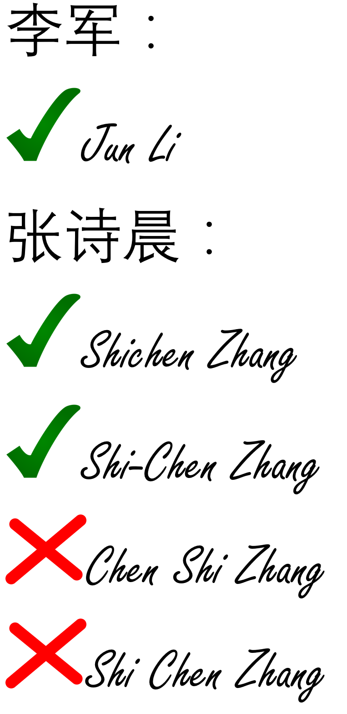
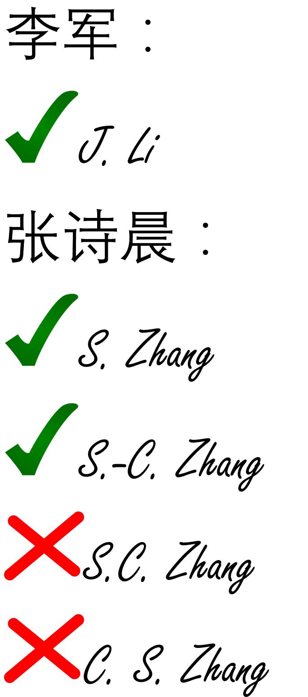
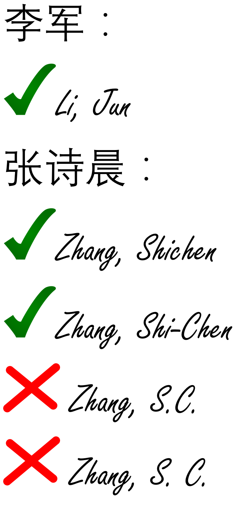

其它生活经验汇总
=========================
签名
------------------
在Canada签名是非常严肃的一件事情。其法律效力等同于国内盖章。在Canada是没有盖章这个说法的，一切都是签名生效。例如你们的offer。下面介绍签名的几种方式：

1) “名的汉语拼音 姓的汉语拼音”

| 解释：名的汉语拼音首字母大写，其它全部小写。或名的各首字母大写，中间加连字符“-”
| 举例：李军的签名为 “Jun Li”
| 张诗晨的签名为 “Shichen Zhang”，或 “Shi-Chen Zhang”
| 注意：千万不能写成：“Chen Shi Zhang” 或 “Shi Chen Zhang” 。因为这样就把原名改了。

2) “名的汉语拼音首字母+'.' 姓的汉语拼音”

| 解释：名的汉语拼音的第一个首字母大写+'.'。或名的各首字母大写+'.'，中间加连字符“-”
| 举例：李军的签名为 “J. Li”
| 张诗晨的签名为 “S. Zhang”，或 “S.-C. Zhang”
| 注意：千万不能写成：“S.C.  Zhang” 或 “C. S. Zhang” 。因为这样就把原名改了。

3) “姓的汉语拼音, 名的汉语拼音”

| 解释：名的汉语拼音首字母大写，其它全部小写。或名的各首字母大写，中间加连字符“-”
| 举例：李军的签名为 “Li, Jun”
| 张诗晨的签名为 “Zhang, Shichen”，或 “Zhang, Shi-Chen”

4) 直接签汉字

| 这个在Canada也是接受的。但是极其不推荐，因为别人验证起来很麻烦。

除这几种之外，签名的时候禁止签自己起的英文名。只有等入籍Canada，办理Canada护照的时候才可以变更自己名字。

作息
------------------
| 加拿大人的作息习惯估计很多刚来的学生都受不了。因为在Canada是没有午休的。并且上课时间也随意安排，并不像在国内上午下午各四节课，晚上还有选修课。
| 中午12点开始可能要连续上3个小时的课，这都是很正常的事。business学院曾经出现过晚上10点半去Burlinton校区上课的情况，等下课已经半夜12点了。
| 有选课自由的学生应尽量避免这种情况。

节假日
---------------------------------
在Canada， 是没有国内那种过年和国庆那种七天假期的，唯一的放假安排是一个周末再加一天，一共三天。即使Canada的国庆节（Canada Day）。

此外除了一些公共的节日外，每个省还有自己的节日，仅仅是本省境内放假，其它省依然继续上课上班。

在Ontario的法定节假日有以下几天：

- New Year's Day：January 1
- Family Day：Third Monday in February
- Good Friday：first Sunday after the first full moon in spring(after March 21st)
- Victoria Day：Monday before May 25
- Canada Day：July 1
- Labour Day：First Monday in September
- Thanksgiving Day：Second Monday in October
- Christmas Day：December 25
- Boxing Day：December 26

比较特殊的是Boxing Day和New Year's Day中间只有几天，所以大多数非服务业的职位依然会放假。

对于学生来说，是没有暑假和寒假的。一个学年有3个term，每个term是4个月。所以不会有任何假期，包括本科生（本科生term3要去校外实习）。

对于研究生来说，大部分研究生虽然课程比较少，term5甚至term3以后就没有任何课程了，但不代表就处于放假状态。准确的说，研究生也没有任何假期，即使没有课也要跟导师一起写论文，或做项目。不过大家也不用担心，如果想回国，可以圣诞节到元旦那几天回去。并且大多数导师都会在一年里批一个月的假。

电压与插座
-------------------------------------
| Canada的家用电压是110V。stove那个插座使用三相电单独供电除外（≥300V）。
| 插座则统一使用美标：2线插座和国内类似，有一边会略长一些，不过完全兼容国内电器的插头。3线则完全不同。
| http://www.worldstandards.eu/electricity/plugs-and-sockets/ab/

.. image:: resource/3LineElectricalSocket.jpg
   :align: center

自来水
--------------------------------
| 正像美国电影里演的那样，Canada的自来水也是可以直接饮用的。而经过house或apt锅炉加热后则不可饮用，因为热水的蓄水池可能长期没消毒，并且热水会有助于细菌病毒的生长。
| 其实不管是冷的还是热的自来水都不建议饮用。因为你永远都不知道输水管道多长时间没有清理了。
| 还是建议大家保持在国内的喝水习惯，买一个电热水壶（kettle），煮沸后再喝。

电费
------------------------------
.. image:: /resource/ElectronicRates.jpg
   :align: center

| 大家住的House或apartment可能电费要另付，这就需要考虑省电的问题了。
| Hamilton的电费是按时段收费的。Weekdays中午费率最高。晚上和周末节假日费率最低
| https://www.horizonutilities.com/myHome/ElectricityRates/Pages/TOU.aspx
| 所以，白天去学校的时候尽量把特别耗电设备关闭。尤其夏天的时候的空调。

消费税
--------------------------------
| 在Canada，消费税是不包括在食品价格里面的。这就需要再购买的时候单独交付。
| 消费税在每个省的税率是不一样的，在Ontario的消费税是GST/HST，它的税率是商品价格的13%。这13%是分为两部分，一部分是联邦5%的税，和Ontario省8%的税。
| http://www.cra-arc.gc.ca/tx/bsnss/tpcs/gst-tps/rts-eng.html
| 绝大多数商品都需要交消费税，比如电子产品，日常用品，各类服务，饮食餐饮等等。
| 也有一些产品是不用交税的：
| http://www.cra-arc.gc.ca/tx/bsnss/tpcs/gst-tps/gnrl/stps/cllct-eng.html#type
| 大体上跟我们相关的有：

 | 1. 超市卖的新鲜水果蔬菜和肉类，以及其它没有牌子直接从农场购买的农产品。
 | 2. 儿童用品。

| 但这些产品一旦被加工过，比如是某品牌食品，或饭店里卖的菜肴等等就要交税了。
| 不过也有个例外：https://www.canada.ca/en/revenue-agency/services/forms-publications/publications/gi-064-harmonized-sales-tax-ontario-point-sale-rebate-on-prepared-food-beverages/harmonized-sales-tax-ontario-point-sale-rebate-on-prepared-food-beverages.html
| 加工过的食物，如果原始价格不超过$4，则不用交Ontario的8%的税，只需要交联邦5%的税即可。

| 如果商品可以退货，那么交的税也会一起退回来。
| HST对于刚来的Canada的同学来说可以退一次，有且只有一次。大概几百加元。

理发店
--------------------------
在Canada理发的时候洗头是需要额外付费的，所以理发店默认顾客理发前和理发后都不需要洗头。比较推荐的有以下理发店：

1. First Choice

  - 加拿大一家很大的美容美发连锁店。
  - http://www.firstchoice.com/
  - 成人单剪$16.45。

2. 华人开的理发店（费用基本和西人洗发店差不多，可能会便宜几加元）

  - Olivia Hair Salon：93 James St N, Hamilton, ON L8R 2K6
  - Amy's Hair & Nails（发艺轩）：76 James St N, Hamilton, ON L8R 2K5
  - Family Hair Cut（斑马）：Unit 1, 222 King St E, Hamilton, ON L8N 1B5

.. raw:: html

    

      <iframe src="https://www.google.com/maps/d/u/0/embed?mid=1CdZTpkU3k56HCJTq2-Di8Ct3mrc" width="640" height="480"></iframe>
    

身份证件
--------------------------------
在Canada是没有像国内那种全国统一的身份证或户口簿的。但可以有替代的证件作为身份证明，叫“Government issued photo ID”。就是政府出具的同时带有全名、出生日期、照片和签名的证件。对于学生来说大概有一下几种：

- Passport（护照）：这个是到Canada的留学生必须具有的证件，有了这个证件才能办理其它各种手续或证件。但经常携带不安全，丢了之后办理需要很久，不建议一直使用。
- Driver License（驾照）：这个是最最常用的证件，大家来Canada之后就应该尽快把G1 License拿到手。有了它基本上可以走遍任何一个地方，办理几乎任何手续（除Study Permit和Study Visa）。
- Ontario Photo Card：可以叫它安大略省身份证。如果大家仅仅短期来Canada，毕业后也不想留在Canada，也不想交将近200刀的费用去考Driver License。可以选择这种比较便宜的方法。费用$35。带上护照去Service Ontario营业点办理。https://www.ontario.ca/page/ontario-photo-card
- Canadian Permanent Resident card with signature（枫叶卡或“绿卡”或永久居民卡）

Toronto Citypass
--------------------------------------------------
提前购买Toronto Citypass可以在游玩多伦多几个主要景点的时候，不用再额外买票。并且非常划算。Citypass只有9天有效期。

https://www.citypass.com/toronto

各大论坛网站
--------------------------------------
| 网址大全：http://www.canada-cn.net/

| 加国无忧：http://www.51.ca/
| 加拿大华人网（新闻）：http://www.sinoca.com/

| 约克论坛（多伦多地区）：http://www.yorkbbs.ca/
| 家园·多伦多（多伦多新闻）：http://toronto.iask.ca/

| Hamilton 华人网：http://www.hamiltonchinese.ca/
| McMaster - 中国学生论坛：http://www.maccssa.org/