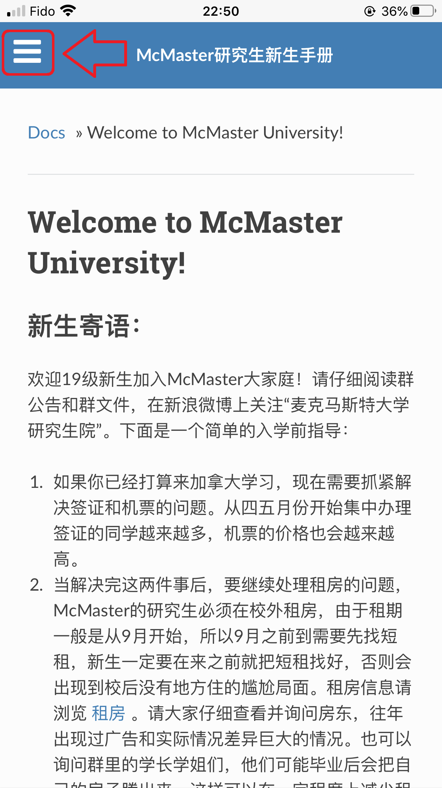
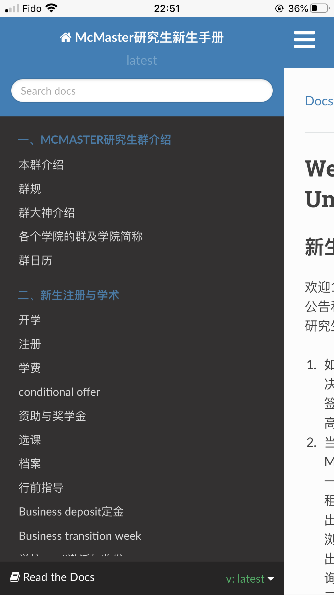
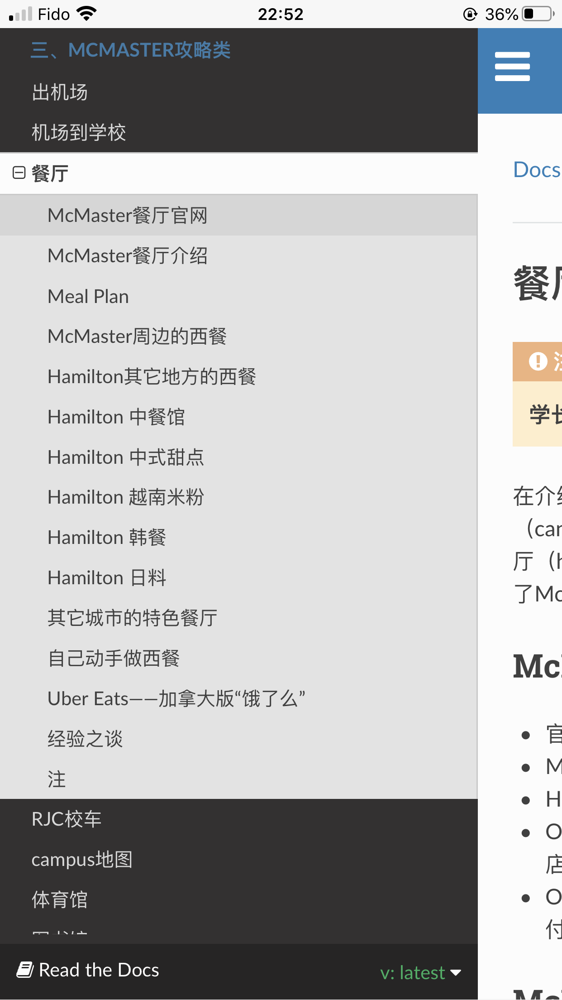

.. McMasterGradStuManual documentation master file, created by
   sphinx-quickstart on Tue Dec 27 15:37:30 2016.
   You can adapt this file completely to your liking, but it should at least
   contain the root `toctree` directive.

Welcome to McMaster University!
=================================================

新生寄语：
-----------------------------
欢迎23级新生加入McMaster大家庭！请仔细阅读群公告和群文件。下面是一个简单的入学前指导：

1. 如果你已经打算来加拿大学习，现在需要抓紧解决签证和机票的问题。从四五月份开始集中办理签证的同学越来越多，机票的价格也会越来越高。
2. 当解决完这两件事后，要继续处理租房的问题，McMaster的研究生必须在校外租房，由于租期一般是从9月开始，所以9月之前到需要先找短租，新生一定要在来之前就把短租找好，否则会出现到校后没有地方住的尴尬局面。租房信息请浏览 `租房`_ 。请大家仔细查看并询问房东，往年出现过广告和实际情况差异巨大的情况。也可以询问群里的学长学姐们，他们可能毕业后会把自己的房子腾出来，这样可以在一定程度上减少租房的麻烦，也比较可信保险。
3. 群里“@陆定维老师”是McMaster研究生院的招生工作负责人，他可以帮大家解决普遍遇到的问题。大家尽量在群里提问并@他，除涉及隐私的问题外，最好不要私聊。其它冷门的问题，请发邮件给研究生院或各学院小秘寻求帮助。联系方式：https://gs.mcmaster.ca/contacts/
4. Canada是一个急需拓宽人际关系的地方。希望大家在来之前就能在群里结识尽可能多的朋友，可以一起飞来Canada，一起租房等等，这也是让大家在进群的时候做自我介绍的一个最重要的原因。对于有导师的新生，请在教授主页上看看他现在的中国学生，在群里搜一下他们的名字，熟悉一下你未来的师兄师姐。
5. 在Google地图上看一看McMaster University及其周边的街景，这样来了之后不会感到陌生。

祝大家学习生活愉快！

——McMaster研究生新生群的管理员们

.. attention::
  - **本网站所有文字内容全部原创，其版权受《中华人民共和国著作权法》、CanadianCopyright Act等保护，未经网站管理员允许，请勿转载或抄袭。一旦发现有任何个人或组织违规，必追究其责任。**
  - **如需引用少数文字内容，请标明出处。请在引用文字的旁边加上本网站或相关网页的网址。谢谢。**

以下关键词列举了常见问题，希望大家仔细阅读：

.. toctree::
   :maxdepth: 1
   :caption: 一、McMaster研究生群介绍

   BenQunJieShao
   QunGui
   QunDaShenJieShao
   GeGeXueYuanDeQun

.. toctree::
   :maxdepth: 1
   :caption: 二、新生注册与学术

   KaiXue
   ZhuCe
   XueFei
   conditional_offer
   JiangXueJin
   XuanKe
   DangAn
   XingQianZhidao
   DepositDingJin
   transition_week
   XueXiaoemailSheZhi
   McMasterChengJiDuiYingBiao

.. toctree::
   :maxdepth: 1
   :caption: 三、McMaster攻略类

   ChuJiChang
   JiChangDaoXueXiao
   CanTing
   RJCXiaoChe
   campusDiTu
   TiYuGuan
   TuShuGuan
   McMasterChengJiDanZhengMingXin
   XueShengHui
   ExtendStudyPermitVisa
   QiTaMcMasterGongLveHuiZong

.. toctree::
   :maxdepth: 1
   :caption: 四、生活类

   HamiltonJieShao
   ZuFang
   YinHang
   BanLiShouJiKa
   SINShenQing
   GongZuo
   Wan
   WiFiYuInternet
   HamiltonRiChangGouWuDiDian
   MaiJiaJu
   KanBingYuBaoXian
   FangWuBaoXian
   BaoShui
   KuaiDiGongSi
   YingShiZiYuan
   FangZhaPianZhiNan
   TanQinQianZheng_ZiNv
   MeiGuoLvYouQianZheng
   RiBenLvYouQianZheng
   QiTAShengHuoJingYanHuiZong

.. toctree::
   :maxdepth: 1
   :caption: 五、交通类

   GongJiaoChe
   JiaZhao
   ZuChe
   MaiChe
   KaiCheJingYan
   QiCheBaoXian

.. toctree::
   :maxdepth: 1
   :caption: 六、电脑、软件类

   MicrosoftChanPin
   AppleChanPin
   BanGongRuanJianHeWangPan
   MATLAB
   BiJiBenDianNaoTuiJian

.. toctree::
   :maxdepth: 1
   :caption: 关于本站

   BenZhanJieShao

本站使用说明
--------------------------------------------------
1) 网站里插入了多幅Google地图和Wikipedia链接， 在国内的同学请翻墙查看。
#) 网站里如发现有任何失效的链接，请速与17-CAS-赵伟联系。
#) 在手机上浏览本网站请尽可能使用菜单，因为有些网页内容较长。

- 第一步：在网页左上角点击三条横线的汉堡图标。

- 第二步：在弹出的菜单里选择相应的主题。

- 第三步：在菜单里可以直接选择某个标题，这样网页可以自动定位到相应的内容。

贡献与反馈：
-----------------------------
- 如有好的意见和建议，欢迎您的 `反馈`_ 。
- 想贡献自己的内容？请联系17-CAS-赵伟。

.. note::

  | 网站维护志愿者招聘：
  | Type 1：内容贡献和审核。负责关注最近研究生群里和平时大家关注的问题，写相关介绍和教程。修改网站里的错误，以及很多过时的内容。
  | Type 2：网站更新。对内容进行整理，编写reStructedText文档。需要Git和GitHub的知识。
  | 有意向的同学，请和17-CAS-赵伟联系。

.. _租房: ZuFang.html
.. _sgsrec@mcmaster.ca: mailto:sgsrec@mcmaster.ca
.. _反馈: mailto:zhaowei0524@outlook.com?Subject=McMaster研究生新生手册反馈
